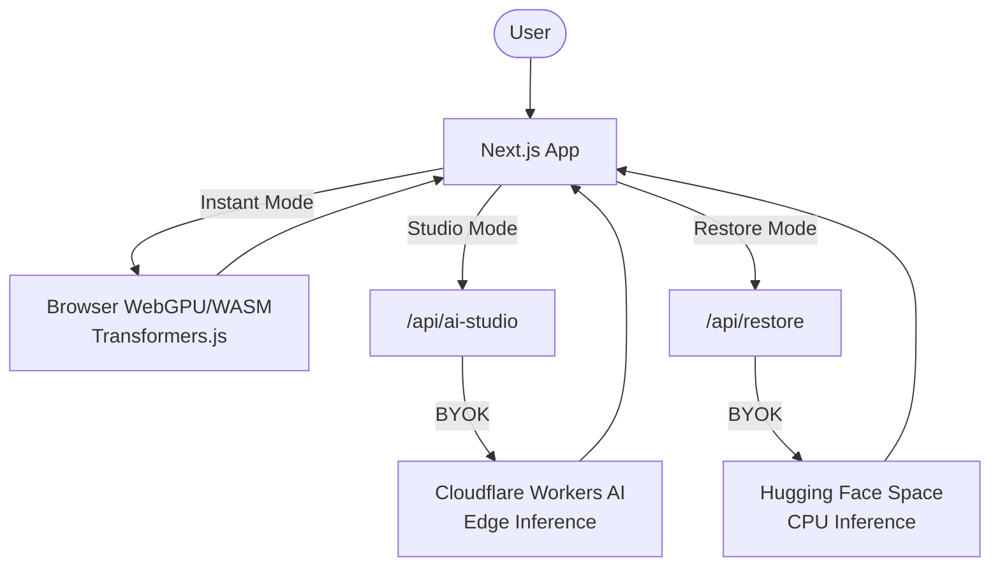

# VibeCraft

[](https://github.com/alokk68/vibecraft/actions/workflows/ci.yml) [](https://nextjs.org/) [](https://www.typescriptlang.org/)

[Live Demo](https://vibecraft.vercel.app) | [Architecture Diagram](#architecture) | [Performance Benchmarks](#performance-benchmarks)

A production-grade AI image studio that runs natively in your browser and on edge infrastructure. Zero cost. Zero server management. Just raw hybrid AI power.

## Performance Benchmarks

| Engine / Mode | Compute Location | Model | Cold Start | Avg Latency | Infrastructure Cost |
| :--- | :--- | :--- | :--- | :--- | :--- |
| **Instant Mode** | Browser WebGPU (WASM fallback) | RMBG-1.4 / Swin2SR | ~2.1s (1st load model fetch) | **~340ms** | **$0.00** |
| **Studio Mode** | Cloudflare Workers AI (Edge) | Llama-3 / SD 1.5 / FLUX.1 | 0ms | **~1.2s** | **$0.00** |
| **Restore Mode** | Hugging Face CPU Space | GFPGAN (PyTorch) | ~12-15s (if idle) | **~4.5s** | **$0.00** |

## Architecture

VibeCraft uses a modern hybrid architecture to eliminate paid GPU dependency:



### Hybrid Architecture Deep Dive
By offloading tasks intelligently across the stack, VibeCraft achieves zero-cost hosting without sacrificing capability:
- **Client-side WebGPU**: Zero latency for pixel-level tasks (background removal, upscaling). Offloads server memory completely by running quantized models (RMBG-1.4, Swin2SR) natively in the browser via `transformers.js`.
- **Edge AI (Cloudflare)**: Fast, stateless generation without paying GPU hosting fees. Cloudflare Workers AI handles the heavy lifting for prompt enhancement (Llama-3) and image generation (SD 1.5 / FLUX.1).
- **Fallback Strategy**: Graceful degradation from WebGPU -> WASM CPU -> Edge API if browser capabilities fail, ensuring maximum device compatibility.
- **Ultimate Mode**: Chains all three sequential pipelines into one seamless flow.

## Production Readiness & Security
- **BYOK (Bring Your Own Key)**: Keys are never logged or stored on our servers. They are securely held in local browser storage and injected into edge requests on the fly.
- **Edge Rate Limiting**: Next.js middleware leverages `@upstash/redis` to rate-limit requests at the edge, protecting public quotas.
- **Zero Database Leakage**: Ephemeral state management ensures no user images or generations are ever saved server-side.

## Challenges I Faced (Battle Scars)
Building a seamless hybrid architecture brought a few headaches:
- **WebGPU vs WASM fallbacks**: WebGPU is still experimental in some browsers (especially older Safari). I had to write a fallback wrapper around `transformers.js` to gracefully drop down to WASM (CPU) if WebGPU fails. It works flawlessly, but the first load can be slightly sluggish while it caches to IndexedDB.
- **Hugging Face Cold Starts**: Free-tier CPU spaces on Hugging Face spin down after 48 hours of inactivity. Sending a Gradio API request to a sleeping space throws a 503. I had to add explicit `AbortController` timeouts and error handling to catch this and warn the user, rather than leaving the UI in an infinite hanging state.
- **Cloudflare's Mask Buffer Quirks**: For inpainting, Cloudflare Workers AI expects the mask as a raw 8-bit integer array buffer, whereas standard image-to-image takes standard base64. I lost a good hour debugging generic 400 errors before realizing I had to parse the base64 into a `Uint8Array`.

## Setup

```bash
npm install
npm run dev
npm run build
```

Remember to copy `.env.example` to `.env.local` to enable Redis rate limiting and Sentry tracking (optional).

<!-- 
GitHub Topics Recommendations: 
nextjs, react, typescript, webgpu, tailwindcss, artificial-intelligence, transformers-js, cloudflare-workers, huggingface, serverless
-->